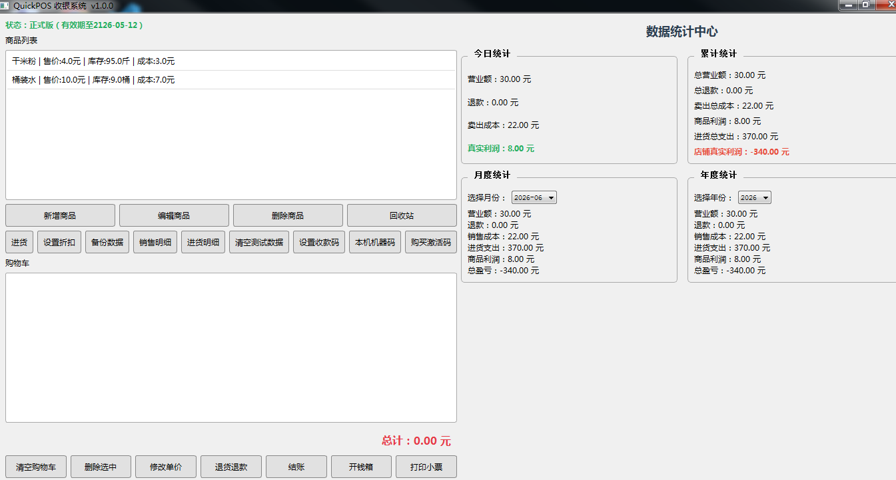
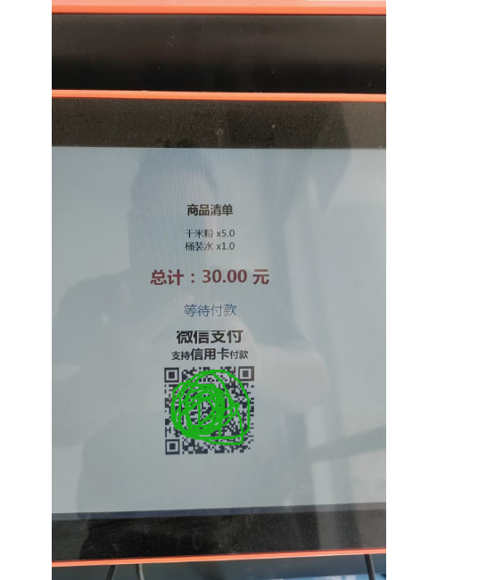

# QuickPOS 收银系统

> 专为双屏收银机设计，简单实用，助力小微店铺高效收银。

---

## 📌 软件简介

QuickPOS 是一款**轻量级双屏收银软件**，支持主屏操作、副屏显示商品明细和收款二维码。无需复杂安装，一个 EXE 文件即可运行，适合餐饮、零售、便利店等小型店铺。

---

## ✨ 主要功能

- **快速收银**：支持手动输入商品，自动计算金额
- **双屏显示**：主屏收银，副屏展示商品清单和收款码
- **小票打印 & 开钱箱**：自动连接默认打印机，支持 ESC/POS 指令
- **商品管理**：添加/编辑/删除商品，支持回收站恢复
- **库存管理**：进货入库，成本核算，自动扣减库存
- **销售报表**：今日/月度/年度营业额、利润、退款统计
- **会员 & 折扣**：支持整单打折、单品改价
- **数据安全**：自动备份数据库，一键恢复

---

## 🖥️ 系统要求

- Windows 7 SP1 / Windows 8 / Windows 10 / Windows 11（32位或64位均可）
- 建议 2GB 以上内存，100MB 可用硬盘空间
- 如需打印小票，请确保已安装打印机驱动

> 注：Windows 7 用户若启动报错，请安装 [Visual C++ Redistributable](https://aka.ms/vs/17/release/vc_redist.x86.exe) 和 KB2999226 补丁。

---

## 💰 价格方案

| 版本 | 价格 | 有效期 |
| :--- | :--- | :--- |
| 年费版 | **99 元/年** | 自激活之日起 365 天 |
| 终身版 | **299 元** | 长期有效（100 年） |

*一次购买，永久使用，免费升级。*

---
## 🛒 购买方式

### 1️⃣ 购买激活码（手工发货）

1. **下载并运行软件**：从下方下载 `QuickPOS.exe`，双击运行。
2. **点击购买按钮**：在软件主界面点击 **“购买激活码”** → 再点击 **“购买正式版（299元）”**，系统会自动打开浏览器跳转到支付页面。
3. **完成支付**：在支付页面使用微信支付 299 元。
4. **获取机器码**：支付成功后，回到软件，点击 **“本机机器码”** 按钮，将显示的机器码复制下来。
5. **发送机器码**：将机器码通过以下方式发送给卖家：
   - 微信：`A18229687380`
   - 邮箱：`23583716@qq.com`
6. **接收激活码**：卖家会在确认收款后，尽快为您生成 52 位激活码并回复给您。
7. **激活软件**：在软件中输入收到的激活码，点击 **“立即激活”**，软件重启后即为永久正式版。

> ⚠️ 请注意：激活码是手工生成的，付款后请主动联系卖家并提供机器码，以免耽误使用。
> 每台电脑的机器码唯一，激活码仅限当前设备使用。

### 2️⃣ 备用购买方式（无需下载软件）

如果您暂时不便下载软件，也可直接通过微信或邮箱联系卖家，沟通购买事宜。

---

## 📦 下载软件

🔗 [点击下载 QuickPOS_v1.0.zip](https://pan.baidu.com/s/1iboPpTf2xOaHMfGGqF4qwQ)  
📦 提取码：`b329`

---

## 📞 技术支持

- **卖家微信**：A18229687380
- **客服邮箱**：23583716@qq.com 
- **软件官网**：https://qystec068-collab.github.io

购买后遇到任何问题，请随时联系，我们会尽快回复。

---

## 📄 软件截图

（这里可以放几张软件界面的截图，建议宽度 800px 以内）

  
*主收银界面*

  
*顾客副屏*

---

## 🔒 版权声明

本软件由 QuickPOS 团队开发，未经授权禁止逆向、破解或二次销售。  
© 2026 QuickPOS. All rights reserved.
